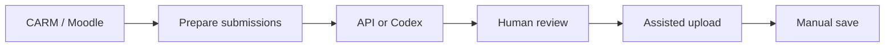

<div align="center">

# Corrector CARM

### A local, human-supervised workflow for reviewing CARM training assignments

[](https://www.python.org/)
[](QUICKSTART.md)
[](SECURITY.en.md)
[](LICENSE)

[Download](#download) ·
[Case study](https://rubenasua.vercel.app/projects/corrector-carm) ·
[Security](SECURITY.en.md) ·
[Español](README.md)

</div>

Corrector CARM is a local Windows application for reviewing practical assignments downloaded from CARM Formación/Moodle. It prepares submissions, produces prompts or draft assessments through the OpenAI API or Codex, and helps transfer grades and feedback after human review.

The design principle is explicit: **the teacher remains in control**. The application prepares, organises and fills drafts, but final publication in CARM always requires a deliberate human action.

## Technical overview

| Area | Implementation |
|---|---|
| Workflow | Download, extraction, preparation, correction, review and import |
| Modes | OpenAI API, external prompts or Codex with a ChatGPT session |
| Interface | Local web panel bound to loopback |
| Automation | Playwright-assisted upload with manual final save |
| Privacy | Credentials, sessions, submissions and results stay outside Git |
| Distribution | Windows installer, guided ZIP, verifier and uninstaller |



## Download

[Download the Windows installer](https://github.com/rubenasuasoto/Corrector_formacionCarm/releases/latest/download/Corrector_CARM_0.3.0-local_Setup_20260616_084646.exe)

Validated release: `0.3.0-local`.

The public installer does not include `.env`, virtual environments, caches, logs, submissions, generated corrections, Codex projects or personal data. Because the executable is not digitally signed, Windows SmartScreen may identify the publisher as unknown. Verify the source and published SHA-256 before running it.

## What it does

- Detects CARM courses and activities.
- Downloads submissions awaiting assessment.
- Prepares prompts by course, unit or practical case.
- Works through OpenAI API or Codex without an API key.
- Imports correction JSON into a reviewable CSV.
- Fills CARM fields in assisted mode and waits for the teacher to save.
- Separates unreadable or uncertain submissions for manual review.

## Recommended workflow

```text
1. Prepare  -> detect the course, download submissions and build prompts.
2. Review   -> use API/Codex, import JSON and inspect the CSV.
3. Upload   -> fill CARM through assisted mode and save each result manually.
```

## Interface

The screenshots contain demonstration data only.


## Installation from source

```powershell
.\INSTALAR_CORRECTOR_CARM.cmd
```

The guided installer prepares Python, dependencies, Playwright Chromium, shortcuts, optional Windows startup and work directories. OCR and Codex CLI support are optional.

To start the installed application:

```powershell
.\ABRIR_CORRECTOR_CARM.cmd
```

## Correction modes

The application supports three paths:

1. **OpenAI API** — the API key remains in the local `.env`.
2. **Prompt export/import** — prompts are resolved elsewhere and imported as JSON.
3. **Codex App** — uses the local ChatGPT/Codex session; no API key is stored by this project.

`OPENAI_API_KEY` is optional when using prompt export or Codex.

## Privacy and safety boundaries

- The interface listens on `127.0.0.1`.
- Local credentials and operational data are excluded from Git and public packages.
- Diagnostic HTML is redacted; screenshots are created only when explicitly requested.
- Assisted upload fills fields but does not perform the teacher's final save.
- Course-specific Codex projects contain teaching context, not submissions or personal data.

See [SECURITY.en.md](SECURITY.en.md), [the architecture document](ARQUITECTURA_PROYECTO.md) and [the release checklist](RELEASE_CHECKLIST.md) before operating on non-demo data.

## Local configuration

Copy `.env.example` to `.env`:

```env
CARM_USUARIO=your_carm_user
CARM_CONTRASENA=
OPENAI_API_KEY=<your_openai_api_key>
OPENAI_MODEL=gpt-5-mini
CARM_DASHBOARD_URL=https://formacion.carm.es/my/index.php
CARM_COURSE_URL=
```

Never commit `.env`.

## Validation

```powershell
.\verificar_app_windows.cmd
.\verificar_app_windows.cmd --instalacion
python verificar_app.py --sin-endpoints
```

Release tooling lives under `tools/windows`. The public artefact must be generated from a clean tree and verified before distribution.

## Status

The validated local release is `0.3.0-local`. This project automates preparation and data entry, not academic judgement or final publication. Difficult or ambiguous submissions remain in a manual-review path.

## Licence

Licensed under the [MIT License](LICENSE).
