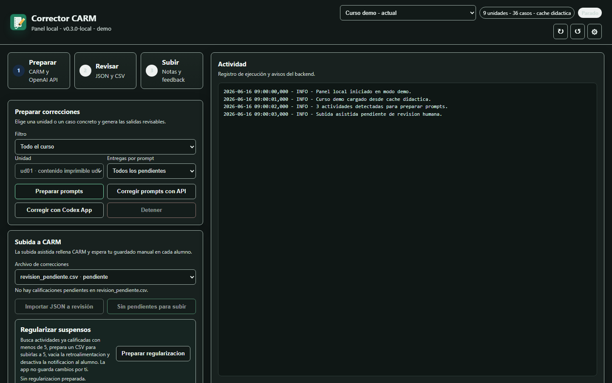
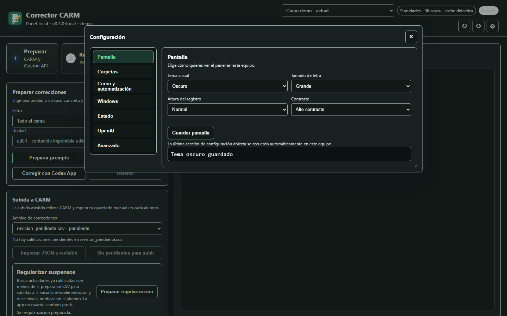

# Agente corrector CARM

Agente local para corregir casos prácticos descargados desde CARM Formación/Moodle, usando prompts resueltos fuera de la app o la API de OpenAI, y dejando siempre una revisión manual antes de publicar notas o retroalimentación.

## Estado corto

El flujo principal ya está implementado en `corrector_agente.py`:

- Versión local validada: `0.3.0-local`.
- Release local validado el 15 de junio de 2026 con ZIP guiado e instalador EXE.
- Corrige entregas locales colocadas en la carpeta activa de pendientes. Con carpetas por curso activadas: `C:\temp\vscodec\cursos\<course_id>\pendientes`.
- Agrupa las entregas por actividad, por ejemplo `ud01cp01` o `ud02cp03`.
- Prepara prompts por lote para reducir llamadas a la IA.
- Crea una carpeta por alumno en la carpeta temporal activa. Con carpetas por curso activadas: `C:\temp\vscodec\cursos\<course_id>\temporal`.
- Copia la entrega original, genera la corrección y escribe resúmenes.
- Genera `revision_pendiente.csv` para revisar notas y feedback antes de subir nada.
- Marca como `revision_manual_necesaria` los archivos que no pueda leer con fiabilidad.

La extracción directa desde CARM, la preparación de prompts, la importación de
JSON y la subida asistida ya forman el flujo operativo. El uso recomendado es
autopromptear, resolver prompts bajo confirmación y subir con modo asistido
desde `revision_pendiente.csv`; el guardado final en CARM sigue siendo humano.

## Vista de la interfaz

Capturas generadas con datos de demostración, sin credenciales ni
entregas reales:





## Documentos importantes

Lee estos archivos en este orden:

1. `docs/README.md`: mapa de documentación.
2. `ESTADO_PROYECTO.md`: memoria viva del proyecto, decisiones tomadas y próximos pasos.
3. `QUICKSTART.md`: comandos rápidos de instalación, prueba y uso.
4. `SECURITY.md`: guía pública para reportar y evitar exposición de datos.
5. `SEGURIDAD_ASVS.md`: controles OWASP ASVS aplicables a esta app.
6. `SEGURIDAD_CVSS.md`: criterio de priorización de riesgos basado en CVSS v4.0.
7. `ARQUITECTURA_PROYECTO.md`: estructura profesional objetivo y estado de archivos.
8. `RELEASE_CHECKLIST.md`: comprobaciones antes de distribuir o usar una version en real.
9. `docs/PUBLICACION.md`: checklist para publicar el repositorio.
10. `docs/DEMO_LOCAL.md`: guía para capturas públicas sin datos reales.
11. `CIERRE_APP_LOCAL.md`: puerta antes de abrir Fase 5.
12. `SOLUCION_PROBLEMAS_WINDOWS.md`: ayuda para Playwright, dependencias, bandeja y puerto local.
13. `prompts_correccion.json`: prompts editables por actividad.
14. `corrector_agente.py`: flujo principal.

El README es solo la entrada general. Si hay duda entre este archivo y `ESTADO_PROYECTO.md`, manda `ESTADO_PROYECTO.md`.

La versión local está en `VERSION`. La interfaz y `verificar_app.py` muestran
versión, commit y si hay cambios locales.

## Instalación

```powershell
.\INSTALAR_CORRECTOR_CARM.cmd
```

Es la entrada recomendada para una instalacion guiada en Windows. Detecta Python 3.12+ y, si falta, intenta instalarlo con `winget`; despues crea `.venv`, instala dependencias, instala Chromium de Playwright si falta, deja `.env` preparado si no existe y crea accesos directos. Si faltan credenciales, el panel se bloquea y guia la configuracion desde la interfaz.

El instalador abre una ventana de configuracion basica: carpeta donde instalar la app, carpeta de datos/descargas, acceso directo, inicio con Windows y apertura al terminar. Tambien muestra una comprobacion previa de Python, dependencias que se prepararan, OCR opcional, carpetas existentes y estado de Node.js/npm/Codex. Si Python o Node.js faltan y Windows dispone de `winget`, el instalador intenta prepararlos automaticamente. La fase tecnica se ejecuta oculta y se muestra como progreso dentro del asistente, sin terminales visibles para el usuario final. Por defecto activa el inicio con Windows y separa datos por curso dentro de la carpeta de datos elegida.

La fase tecnica del instalador se muestra como checklist integrado, no como terminal: Python, entorno virtual, dependencias, OCR, Codex, Chromium, lanzador, verificacion, accesos y desinstalador. OCR es opcional; si Tesseract no puede instalarse, la app queda operativa y esos documentos pasan a revision manual.

Si reinstalas sobre carpetas existentes, el instalador actualiza la app, conserva `.env` y reutiliza datos/configuracion compatibles. La carpeta de datos queda organizada en `pendientes`, `temporal` y `cursos`; con separacion por curso, cada curso vive en `cursos\<course_id>`.

Tambien incluye una casilla para preparar Codex sin API. Si la marcas, el instalador detecta Node.js/npm, intenta instalar Node.js LTS con `winget` si falta e instala/actualiza el CLI oficial con `npm i -g @openai/codex`. Para usarlo hay que iniciar sesion una vez con ChatGPT mediante `codex login`; la app puede preparar el CLI, pero no iniciar sesion por el usuario. No se usa el Codex de VS Code para este flujo.

La instalacion se registra para el usuario actual en **Aplicaciones instaladas** de Windows como `Corrector CARM`. Desde ahi se puede desinstalar. Tambien puedes usar:

```powershell
.\desinstalar_windows.cmd
```

Por defecto la desinstalacion quita app, accesos, inicio automatico y entrada de Windows, pero conserva los datos locales. En modo grafico puedes elegir si borrar pendientes/prompts, CSV temporales o cursos/cache/proyectos Codex. Para borrar todo desde consola, ejecuta:

```powershell
.\desinstalar_windows.ps1 -EliminarDatos
```

Para borrar solo una parte desde consola:

```powershell
.\desinstalar_windows.ps1 -EliminarPendientes
.\desinstalar_windows.ps1 -EliminarTemporal
.\desinstalar_windows.ps1 -EliminarCursos
```

En otro ordenador, si se quiere usar Codex sin API y no se marco esa opcion en el instalador, se puede preparar manualmente asi:

```powershell
winget install --id OpenJS.NodeJS.LTS --source winget
npm i -g @openai/codex
codex login
```

La app busca `codex.cmd` en `AppData\Roaming\npm`, inyecta `C:\Program Files\nodejs` al ejecutar Codex y evita `codex.ps1` para no chocar con politicas de PowerShell.

Para abrir el panel despues de instalar:

```powershell
.\ABRIR_CORRECTOR_CARM.cmd
```

Los scripts tecnicos siguen disponibles:

Opciones utiles:

```powershell
.\instalar_windows.cmd -ConExtraccion
.\instalar_windows.cmd -InstalarArranque
.\instalar_windows.cmd -CrearAccesoDirecto
.\reparar_dependencias_windows.cmd
.\iniciar_app_windows.cmd -AbrirNavegador
```

Para verificar dependencias, Chromium, configuracion local y prueba offline:

```powershell
.\verificar_app_windows.cmd
```

Tambien comprueba endpoints locales basicos y que el token local bloquea peticiones sin autorizacion.

En una instalacion nueva sin credenciales ni curso activo:

```powershell
.\verificar_app_windows.cmd --instalacion
```

Para preparar un release local con manifiesto:

```powershell
.\preparar_release_windows.cmd
```

Para crear un ZIP guiado para instalar en otro Windows:

```powershell
.\crear_paquete_windows.cmd
```

El paquete no incluye `.env`, `.venv`, cache, logs, entregas ni correcciones generadas.

Para crear un instalador EXE autoextraible de un solo archivo:

```powershell
.\crear_instalador_setup_windows.cmd
```

El EXE contiene el paquete limpio y lanza `INSTALAR_CORRECTOR_CARM.cmd` automaticamente tras extraerlo en una carpeta temporal. Es la ruta pensada para usuarios finales que no deben descomprimir carpetas. Si no se firma digitalmente, Windows puede avisar de editor desconocido.

Dependencias opcionales para leer PDF, PDF escaneados, PPTX/PPTM, XLSX/XLSM, ODT/ODS/ODP, EPUB, ZIP e imágenes con OCR:

```powershell
pip install -r requirements-extraccion.txt
```

Para OCR de JPG/PNG y PDF que contienen texto como imagen también hace falta Tesseract OCR instalado en Windows y disponible en el `PATH`. Si no está disponible, la app deja la entrega en revisión manual en vez de calificarla como vacía.

El instalador guiado permite marcar la instalación de OCR. Si el equipo no permite instalar Tesseract automáticamente, la app no se rompe: queda instalada y esos archivos se tratarán como revisión manual.

Puedes intentar instalarlo con:

```powershell
.\instalar_ocr_windows.cmd
```

## Configuración

Copia `.env.example` a `.env` y rellena credenciales:

```env
CARM_USUARIO=tu_usuario_carm
CARM_CONTRASENA=
# Rellena CARM_CONTRASENA solo en tu .env local.
OPENAI_API_KEY=<tu_api_key_openai>
OPENAI_MODEL=gpt-5-mini
CARM_DASHBOARD_URL=https://formacion.carm.es/my/index.php
CARM_COURSE_URL=
```

No subas `.env` al repositorio.

`OPENAI_API_KEY` es opcional si corriges con el modo solo prompts y luego importas los JSON. No guardes API keys, tokens o contraseñas en archivos `.txt`. Las claves locales deben vivir solo en `.env`.

Desde el panel, la configuracion esta dividida por secciones: `Pantalla`, `Carpetas`, `Curso y automatizacion`, `Windows`, `Estado`, `OpenAI` y `Avanzado`. En `Pantalla` puedes elegir tema automatico de Windows, claro u oscuro, tamaño de letra, altura del registro y alto contraste; las preferencias se guardan en `.corrector_app.json`.

## Uso sin API

Para aprovechar Codex/ChatGPT manualmente sin llamadas de API:

```powershell
python corrector_agente.py --preparar-carm-codex --unidad ud01
```

El agente lee las entregas, las agrupa por actividad y genera archivos en la carpeta activa de prompts. Con `Separar carpetas por curso`: `C:\temp\vscodec\cursos\<course_id>\pendientes\prompts_codex`.

Despues puedes usar las instrucciones de `INSTRUCCIONES_CODEX_PERSONALIZADAS.md` y escribir `$C`, `$C ud01cp02` o `$C todas` en Codex. Ese flujo no entra en CARM, no mueve archivos y crea un `*_correccion.json` por prompt en la misma carpeta.

Si tienes Codex Desktop instalado, iniciado con ChatGPT y con CLI ejecutable disponible, la interfaz tambien podra resolver los prompts sin `OPENAI_API_KEY` con `Corregir con Codex App`. Internamente usara `codex exec --cd <codex_project>`, guardara los JSON individuales, generara el CSV revisable y mantendra la subida a CARM como proceso asistido con revision humana. El Codex de VS Code queda fuera de esta ruta para evitar depender de la extension.

La interfaz puede preparar y abrir un proyecto local de Codex por curso en `C:\temp\vscodec\cursos\<course_id>\codex_project`. Ese proyecto exporta solo cache didactica y enunciados (`contexto_didactico.md`, `actividades.json`, `AGENTS.md` y `unidades/*.md`), no entregas ni datos personales. A diferencia del prompt/API, Codex recibe un contexto mas amplio: `contexto_didactico.md` actua como indice y cada archivo de `unidades/` contiene el contenido imprimible completo de esa unidad. En `Configuracion > Windows` se puede marcar que Codex App se abra con ese proyecto al iniciar Windows junto al Corrector CARM.

Cuando la lectura automatica de una entrega parece dudosa, el prompt anade `calidad_extraccion` como aviso interno. Codex debe revisar el archivo original indicado en `archivo` si tiene acceso antes de penalizar por texto incompleto, caracteres extraños u OCR, y esos problemas no deben aparecer en la retroalimentacion salvo que existan tambien en el documento real del alumno.

`codex_project` es una carpeta operativa solo para Codex App: queda fuera de Git, fuera del paquete ZIP y fuera del flujo de subida a CARM.

La carpeta se crea o actualiza automaticamente al seleccionar un curso con cache didactica disponible, y tambien al terminar correctamente un escaneo de curso que acaba de generar esa cache.

En Windows, la apertura automatica del proyecto requiere que Codex Desktop exponga un CLI ejecutable. La app detecta la instalacion de `OpenAI.Codex`, pero no fuerza permisos sobre `WindowsApps` ni usa el `codex.exe` de VS Code.

Cuando existan los `*_correccion.json`, vuelve a la interfaz y pulsa `Importar JSON a revision`. Puedes importar un JSON concreto o todos los JSON pendientes. La app los pasara a `revision_pendiente.csv` y archivara los prompts ya usados.

## Uso con entregas locales

Coloca las entregas en la carpeta activa de pendientes y ejecuta:

```powershell
python corrector_agente.py --preparar-prompts-codex
```

Forzando una actividad concreta:

```powershell
python corrector_agente.py --preparar-prompts-codex --actividad-codigo ud02cp03
```

Conservando los archivos en pendientes durante pruebas:

```powershell
python corrector_agente.py --preparar-prompts-codex --conservar-pendientes
```

## Extracción desde CARM

Primero conviene diagnosticar la navegación real:

```powershell
python corrector_agente.py --diagnosticar-carm
```

El diagnóstico guarda un `diagnostico.json` limpio en `logs_correcciones\diagnostico_carm`, sin descargar ni corregir entregas. Por defecto no guarda HTML ni capturas.

Para depurar selectores con evidencias redactadas:

```powershell
python corrector_agente.py --diagnosticar-carm --guardar-evidencias
```

Para listar entregas que requieren calificación sin descargar archivos:

```powershell
python corrector_agente.py --solo-listar-carm
```

Para la primera unidad:

```powershell
python corrector_agente.py --solo-listar-carm --unidad ud01
```

Para cachear contenido imprimible y enunciados de una unidad:

```powershell
python corrector_agente.py --cachear-curso --unidad ud01
```

La cache local vive en `cache_carm\curso_1592.sqlite` y no guarda entregas ni datos personales de alumnos.
Se usa automáticamente cuando existe. Si `CARM_COURSE_END_DATE` ya pasó, se borra al iniciar.

```powershell
python corrector_agente.py --extraer-carm
```

Este modo descarga entregas desde CARM a la carpeta activa de pendientes y despues corrige por lotes. Con carpetas por curso activadas: `C:\temp\vscodec\cursos\<course_id>\pendientes\<actividad>\`. Para uso real, conviene limitar por `--unidad` o `--actividad` y revisar las salidas antes de publicar.

Para descargar desde CARM y generar solo prompts para Codex, sin API:

```powershell
python corrector_agente.py --preparar-carm-codex
```

Primera ejecución recomendada, limitada a unidad 1 y con prompts por lotes, usando una sola sesión de Playwright:

```powershell
python corrector_agente.py --preparar-carm-codex --unidad ud01 --max-entregas-por-prompt 6
```

Este comando actualiza cache, registra filas de CARM, descarga entregas y genera prompts sin cerrar y abrir Chromium entre pasos.

## Flujo recomendado actual

1. Preparar prompts sin gastar API ni publicar en CARM:

```powershell
python corrector_agente.py --preparar-carm-codex --unidad ud01 --max-entregas-por-prompt 0
```

Este comando entra en CARM, descarga entregas pendientes, genera prompts en la carpeta activa de prompts y archiva las entregas ya convertidas en prompt para no duplicarlas.

2. Resolver prompts:

Con API configurada, desde la interfaz pulsa `Corregir prompts con API` o ejecuta:

```powershell
python corrector_agente.py --pendientes C:\temp\vscodec\cursos\<course_id>\pendientes --temporal C:\temp\vscodec\cursos\<course_id>\temporal --corregir-prompts-openai
```

Sin API, usa Codex u otra IA con `INSTRUCCIONES_CODEX_PERSONALIZADAS.md`. Debe crear un JSON por prompt con el patron `prompt_udXXcpYY_correccion.json` en la misma carpeta de prompts.

3. Subir a CARM con revision humana:

La app importa las correcciones a `revision_pendiente.csv` dentro de la carpeta temporal activa. Ese CSV es la fuente fiable para rellenar CARM. Usa la subida asistida desde la interfaz o:

```powershell
python corrector_agente.py --subir-correcciones-carm C:\temp\vscodec\cursos\<course_id>\temporal\revision_pendiente.csv --subida-asistida-carm
```

La subida asistida rellena nota y feedback, pero el guardado en CARM lo hace el docente. Las filas confirmadas o ya gestionadas se eliminan del CSV. Los prompts, correcciones y resumenes usados se archivan para evitar gasto o subida duplicada.

## Interfaz local

Para usar la aplicación desde navegador:

```powershell
python interfaz_app.py
```

Abre `http://127.0.0.1:8765`. La interfaz ejecuta solo los flujos permitidos: preparar prompts, corregir prompts con API bajo confirmacion e iniciar subida asistida a CARM.

Después de pegar el prompt en Codex/ChatGPT, guarda el JSON de respuesta e impórtalo:

```powershell
python corrector_agente.py --importar-correcciones-codex C:\ruta\correcciones_ud01.json
```

Esto genera los `.txt` por alumno, los resúmenes y `revision_pendiente.csv` sin llamar a la API.

La subida recomendada es `--subida-asistida-carm`: la app rellena los campos y no avanza hasta detectar que CARM ha guardado y que el usuario lo confirma en el panel.

## Salidas

En la carpeta temporal activa. Con carpetas por curso activadas:

```text
C:\temp\vscodec\cursos\<course_id>\temporal
```

- `<alumno>\<actividad>.ext`: copia de la entrega.
- `<alumno>\<actividad>.txt`: corrección generada.
- `resumen.txt`: resumen global.
- `resumen_<actividad>.txt`: resumen por actividad.
- `revision_pendiente.csv`: hoja para revisar antes de publicar.

Todo queda en estado `borrador_pendiente_de_revision` salvo los casos que necesitan revisión manual.

## Próximos pasos

- Mantener `docs/VALIDACION_RELEASE_0.3.0-local.md` actualizado si se regenera
  el instalador o cambia el flujo de instalación.
- Repetir la validación en otro perfil o equipo Windows limpio antes de
  recomendarlo fuera del entorno de desarrollo.
- Seguir endureciendo pruebas automáticas para importación, prompts duplicados,
  subida asistida y desinstalación.
- Mejorar OCR y conversión de entregas difíciles cuando haya casos reales
  suficientes para probar sin exponer datos.
